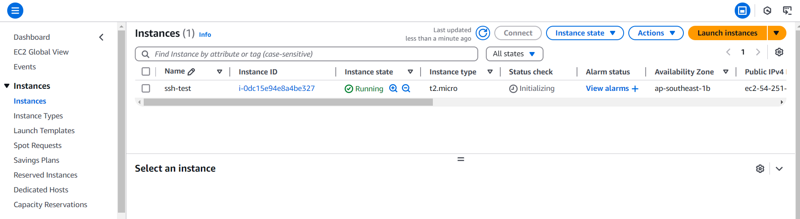
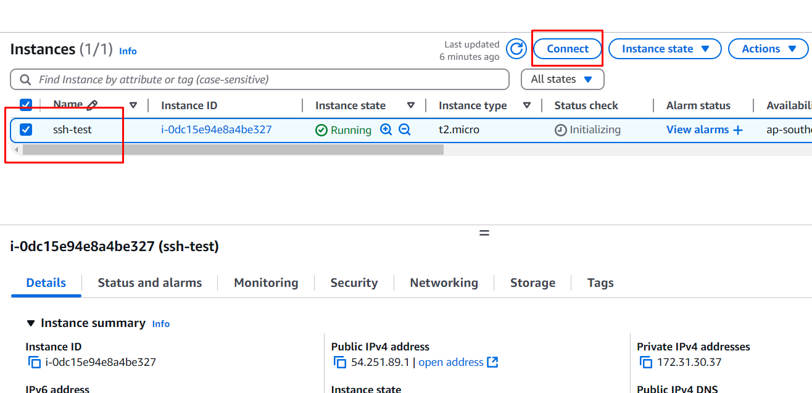

## Basic SSH in AWS EC2

---

#### Outline:

- Apa itu EC2 Instance?
- Bagaimana meluncurkan sebuah EC2 Instance?
- Bagaimana membuat SSH key (Public, Private)?
- Bagaimana melakuan SSH ke EC2 Instance?

#### Apa itu EC2 Instance?

EC2 instance merupakan layanan komputasi awan dari AWS (Amazon Web Service) yang mungkinkan pengguna untuk menjalankan mesin virtual di cloud dengan berbagai konfigurasi dan spesifikasi yang dapat disesuaikan. Untuk lebih lengkapnya klik [di sini](https://docs.aws.amazon.com/id_id/AWSEC2/latest/UserGuide/concepts.html)

#### Bagaimana meluncurkan sebuah EC2 Instance & Membuat SSH Key

1. Cari layanan `AWS EC2` pada searchbar AWS console
2. pilih `intances` pada bagian intances di sidebar halaman EC2
3. pilih tombol `launch intances` pada bagian pojok kanan atas
4. Sesuaikan konfigurasi EC2 pada contoh berikut:
   - Name and tags:
     - Name: ssh-test
   - Application and OS Images (Amazon Machine Image):
     - Quick Start: ubuntu
     - Amazon Machine Image (AMI): Ubuntu Server 24.04 LTS (HVM), SSD Valume Type (free tier eligible)
   - Instance Type:
     - Instance type: t2.micro
   - Key pair (login):
     - Key pain name - _required_ : create new key pair
     - key pair name: ssh-test-key-pair
     - key pair type: RSA
     - private key file format: .pem
     - klik create key pair
     - key pair otomatis akan terdownload di perangkat
   - Network Setting:
     - check Allo SSH traffic form (Anywhere 0.0.0.0/0)
   - klik Launch intance
5. jika sudah, maka VM atau EC2 yang telah dibuat akan muncul seperti pada gambar berikut:
   

#### Melakukan SSH ke EC2

1. checklist VM yang telah dibuat dan klik tombol connect:
   
2. Pilih SSH client
3. Ikuti instruksi yang telah diberikan
