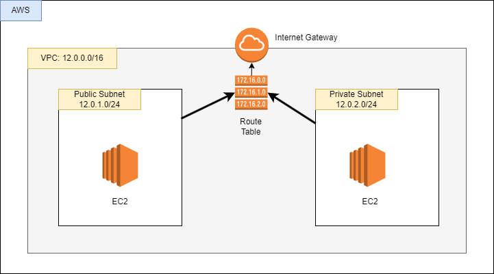

## Basic VPC and SUBNET

---

#### Outline:

- Penjelasan terkait VPC, Subnet, Routing Table, Internet Gateway
- Apa keterkaitan antar komponen tersebut?
- Implementasi sederhana

#### Penjelasan:

- VPC: Merupakan jaringan virtual di AWS yang memungkinkan Anda untuk mengelola sumber daya AWS dalam lingkungan jaringan yang terisolasi secara logis. VPC berfungsi seperti jaringan tradisional di data center on-premises, di mana Anda dapat mengontrol pengaturan jaringan seperti alokasi alamat IP, subnet, routing, firewall, dan akses keamanan. [lebih lengkapnya...](https://docs.aws.amazon.com/id_id/vpc/latest/userguide/what-is-amazon-vpc.html)
   

- Subnet: Merupakan sebuah rentatng alamat IP di VPC. subnet berfungsi untuk mengatur grup sumber daya ke dalam segmen jaringan yang lebih kecil berdasarkan wilayah geografis (Availability Zone) [lebih lengkapnya...](https://docs.aws.amazon.com/id_id/vpc/latest/userguide/configure-subnets.html)
   
- Route Tabe: Merupakan seperangkat aturan, yang disebut rute, yang menentukan ke mana lalu lintas jaringan dari subnet atau gateway Anda diarahkan. [lebih lengkapnya..](https://docs.aws.amazon.com/id_id/vpc/latest/userguide/VPC_Route_Tables.html)
   
- Internate Gateway: Merupakan sebuah gateway yang digunakan untuk mekanisme komunikasi antara VPC dan internet. [lebih lengkapnya...](https://docs.aws.amazon.com/id_id/vpc/latest/userguide/VPC_Internet_Gateway.html)

#### Keterkaitan antar komponen

- VPC sebagai jaringan utama:
  Semua sumber daya seperti EC2 atau RDS dijalankan di dalam VPC.

- Subnet sebagai subdivisi:
  Subnet membagi VPC menjadi zona kecil untuk memisahkan resource berdasarkan fungsi:
- Public Subnet untuk resource yang memerlukan akses langsung ke internet.
- Private Subnet untuk resource yang hanya berkomunikasi secara internal.
- Routing Table mengatur arah lalu lintas:
  Routing Table menentukan jalur lalu lintas untuk setiap subnet:
- Public Subnet diarahkan ke Internet Gateway.
  Private Subnet diarahkan ke NAT Gateway untuk akses keluar saja.
- Internet Gateway sebagai jembatan ke internet:
  Internet Gateway memungkinkan resource di public subnet berkomunikasi langsung dengan internet.

#### Contoh Implementasi

Arsitektur:

_CREATE VPC_

- pilih service VPC -> create VPC
- VPC setting:
  - Name tag: test-vpc
  - IPv4 CIDR: 12.0.0.0/16
- button: create VPC

_CREATE IGW_

- pilih internet gateway di sidebar (halaman service VPC)
- button: create internet gateway
- Name tag: IGW-test
- Button: create Internet gateway

_Attach IGW to VPC_

- klik Internet gateway ID yang telah dibuat
- Button dropdown "Action": Attach to VPC
- Available VPCs : test-vpc
- Button: Attach internet gateway

_CREATE SUBNET_

- pilih subnet di sidebar (halaman service VPC)
- Button: Create subnet
- VPC:
  - VPC ID: test-vpc
- Subnet settings:
  - Subnet name: test-public-subnet-1a
  - Availability zone: ap-southeast-1a
  - IPv4 CIDR block: 12.0.1.0/24
- Button: Add new subnet
  - Subnet name: test-private-subnet-1a
  - Availability zone: ap-southeast-1a
  - IPv4 CIDR block: 12.0.2.0/24
- Button: Create subnet

_CREATE ROUTE TABLE_

- pilih Route tables di sidebar (halaman service VPC)
- button: Create route table
- Name: RT-test-public
- VPC: test-vpc
- Button: Create route table
- open route table yang sudah dibuat
- Button: Edit Route
- Button: Add route
- Destination: 0.0.0.0/0
- Target: IGW-test
- Button: save changes
- (masih di halaman route table RT-test-public)
- Tab: Subnet association
- Button: Edit subnet association
- check public subnet punya kita
- Button: save association

BIKIN YANG VERSI PRIVATE SUBNET UNTUK ROUTE TABLE

- pilih Route tables di sidebar (halaman service VPC)
- button: Create route table
- Name: RT-test-private
- VPC: test-vpc
- Button: Create route table
- open route table yang sudah dibuat
- [tidak konfigurasi route ke public]
- (masih di halaman route table RT-test-public)
- Tab: Subnet association
- Button: Edit subnet association
- check private subnet punya kita
- Button: save association

_CREATE RESOURCE IN VPC_
EC2 for public subnet

- bikin instance seperti biasa tetapi yang diubah pada bagian Network setting
- VPC: test-vpc
- Subnet: test-public-subnet-1a
- Auto-assign public IP: enable
- Firewall (security group): create security group
- Security group name: test-ec2-SG
  - enamble SHH
