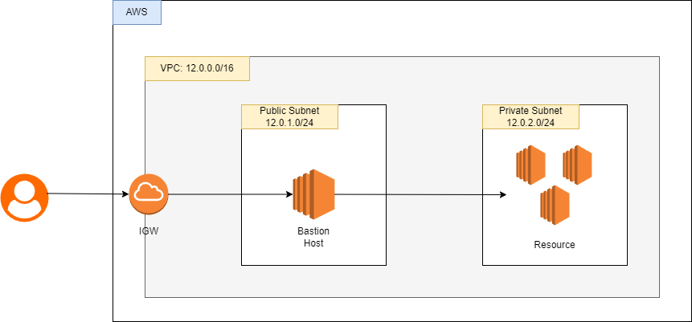

## Bastion HOST

---

#### Outline:

- Penjelasan terkait Bastion HOst
- Implementasi sederhana

#### Penjelasan:

Bastion host merupakan sebuah server yang digunakan untuk mengkases resource di jaringan private.
Server ini (bastion host) berfungsi jembatan antara user dengan resource yang tidak memiliki koneksi ke jaringan luar

#### Contoh Implementasi

Arsitektur:

_CREATE VPC_

- pilih service VPC -> create VPC
- VPC setting:
  - Name tag: test-vpc
  - IPv4 CIDR: 12.0.0.0/16
- button: create VPC

_CREATE IGW_

- pilih internet gateway di sidebar (halaman service VPC)
- button: create internet gateway
- Name tag: IGW-test
- Button: create Internet gateway

_Attach IGW to VPC_

- klik Internet gateway ID yang telah dibuat
- Button dropdown "Action": Attach to VPC
- Available VPCs : test-vpc
- Button: Attach internet gateway

_CREATE SUBNET_

- pilih subnet di sidebar (halaman service VPC)
- Button: Create subnet
- VPC:
  - VPC ID: test-vpc
- Subnet settings:
  - Subnet name: test-public-subnet-1a
  - Availability zone: ap-southeast-1a
  - IPv4 CIDR block: 12.0.1.0/24
- Button: Add new subnet
  - Subnet name: test-private-subnet-1a
  - Availability zone: ap-southeast-1a
  - IPv4 CIDR block: 12.0.2.0/24
- Button: Create subnet

_CREATE ROUTE TABLE_

- pilih Route tables di sidebar (halaman service VPC)
- button: Create route table
- Name: RT-test-public
- VPC: test-vpc
- Button: Create route table
- open route table yang sudah dibuat
- Button: Edit Route
- Button: Add route
- Destination: 0.0.0.0/0
- Target: IGW-test
- Button: save changes
- (masih di halaman route table RT-test-public)
- Tab: Subnet association
- Button: Edit subnet association
- check public subnet punya kita
- Button: save association

BIKIN YANG VERSI PRIVATE SUBNET UNTUK ROUTE TABLE

- pilih Route tables di sidebar (halaman service VPC)
- button: Create route table
- Name: RT-test-private
- VPC: test-vpc
- Button: Create route table
- open route table yang sudah dibuat
- [tidak konfigurasi route ke public]
- (masih di halaman route table RT-test-public)
- Tab: Subnet association
- Button: Edit subnet association
- check private subnet punya kita
- Button: save association

_CREATE RESOURCE IN VPC_

EC2 for public subnet

- bikin instance seperti biasa tetapi yang diubah pada bagian Network setting
- VPC: test-vpc
- Subnet: test-public-subnet-1a
- Auto-assign public IP: enable
- Firewall (security group): create security group
- Security group name: sg-public-ec2
  - enamble SHH

EC2 for private subnet

- bikin instance seperti biasa tetapi yang diubah pada bagian Network setting
- VPC: test-vpc
- Subnet: test-private-subnet-1a
- Auto-assign public IP: disable
- Firewall (security group): create security group
- Security group name: sg-private-ec2
  - TYPE SSH:
    - Source type: custom
    - Source: 12.0.1.0/24 (IP bastion host)
