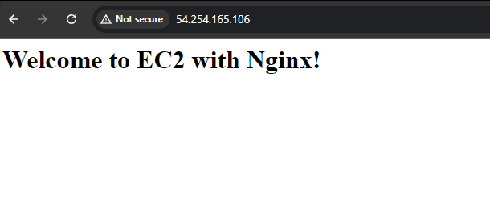

## EC2 USER DATA

---

#### Outline:

- Penjelasan terkait User Data
- Implementasi sederhana

#### Penjelasan:

Userdata pada AWS EC2 merupakan sebuah script atau perintah yang akan dieksekusi secara otomatis ketika instance atau server pertama kali dijalankan. [lebih lengkapnya..](https://docs.aws.amazon.com/AWSEC2/latest/UserGuide/user-data.html)

#### Contoh Implementasi

1. Buka halaman EC2 pada AWS Console
2. Pilih Tab Instances -> launch instances
3. Ikuti Konfigurasi sederhana bebrikut:

   - Name and Tags: test-ec2-userdata
   - Application and OS Images (Amazon Machine Image) :
     - OS Image / Quick Start: Ubuntu
   - Instance Type: t2.micro
   - Key pair: (silahkan dibuat kalau belum mempunyai)
   - Network Setting -> Edit
     - Inbound Security Group Rules -> Add Security Group
     - Type: HTTP, Source Type: Anywhare
     - Add Security Group
     - Type: HTTPS, Source Type: Anywhare
   - Advance Detail -> User data:
     - isikan kode berikut pada text box tersebut:

   ```bash
       #!/bin/bash
       # Update package list
       apt update -y

       # Install Nginx
       apt install -y nginx

       # Start and enable Nginx to run on boot
       systemctl start nginx
       systemctl enable nginx

       # Custom welcome page
       echo "<h1>Welcome to EC2 with Nginx!</h1>" > /var/www/html/index.html
   ```

   - Tekan button: Launch instance
   - Tunggu hingga intance dibuat dan healthy
   - Testing dengan mengcopy IP public dan buka di browser
   - Maka akan munncul Gambar berikut:
     

   - jika ingin melihat log dari proses script user data masukkan command berikut pada terminal instace:

   ```
   cat /var/log/cloud-init.log
   ```
